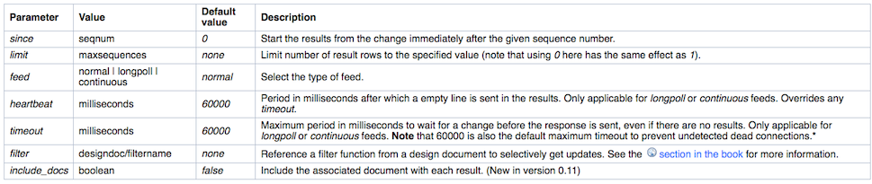

<!SLIDE Section>

# CouchDB Change Notifications #

<!SLIDE bullets>

# Overview #

* activity stream from a database
* polling
* _changes database API
* cache invalidation
* decoupled systems

<!SLIDE>

# Changes Structure #

	@@@ javascript
	{
		"seq":12, 
		"id":"foo", 
		"changes":
			[{"rev":"1-23202479...7a776743d5"}]
	}

<!SLIDE bullets>

# Ways to Request   Notifications #

* Polling (default)
* Long polling
* Continuous

<!SLIDE small>

# Polling for Changes #

	@@@ javascript
	$ curl -X GET http://localhost:5984/db/_changes
	
	{
		"results":[ 
			{"seq":1,"id":"test","changes":
				[{"rev":"1-aaa8e2a031bc...8b6682fb486"}]}, 
			{"seq":2,"id":"test2","changes":
				[{"rev":"1-e18422e6a821...b5dcf457997"}]} 
		], 
	 	"last_seq":2
	}

<!SLIDE small>

# Polling for Changes - since #

	@@@ javascript
	curl -X GET http://localhost:5984/db/_changes?since=1
	
	{
		"results":[ 
			{"seq":2,"id":"test2","changes":
				[{"rev":"1-aaa8e2a031bc...8b6682fb486"}]}
		], 
		"last_seq":2
	}
	
<!SLIDE bullets>

# Long Polling #

* HTTP connection opened for each notification
* feed=longpoll
* Works well for low-frequency updates
* heartbeat=N

<!SLIDE smaller>

# Long Polling

	00:00: $ curl -X GET "$HOST/db/_changes?feed=longpoll&since=2" 
	00:00: {"results":[ 
	00:10: {"seq":3,"id":"test3","changes":[{"rev":"1-02c6...324"}]} 
	00:10: ], 
	00:10: "last_seq":3}
	
<!SLIDE bullets>

# Continuous Changes #

* HTTP connection opened “forever”
* feed=continuous
* heartbeat=N
* no wrapping JSON Object

<!SLIDE smaller>

# Continuous Changes #

	00:00: $ curl -X GET "$HOST/db/_changes?feed=continuous&since=3" 
	00:10: {"seq":4,"id":"test4","changes":[{"rev":"1-02c6...324"}]} 
	00:15: {"seq":5,"id":"test5","changes":[{"rev":"1-02c6...324"}]}
	
<!SLIDE bullets>

# Filters #

* Stored in design documents
* Filter changes results: include the doc (return true) or not (return false)

<!SLIDE small>

# Filters #

	@@@ javascript
	{
		"_id": "_design/app", 
		"_rev": "1-b20db05077a51944afd11dcb3a6f18f1", 
		"filters": {
			"important": "function(doc, req) { 
				if(doc.priority == 'high') { return true; } 
				else { return false; }
			}"
		}	
	}
	
	curl -X GET "$HOST/db/_changes?filter=app/important"
	
<!SLIDE center>

# Changes Parameters #

<!SLIDE bullets incremental>

# CBT Use Cases #

* Generation of history beans
* Generation of notifications
* Cache invalidation
* Chat